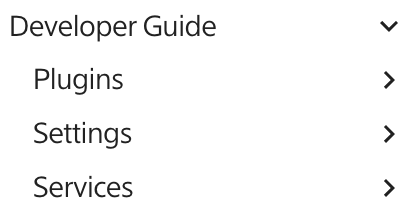

# SolarNode Handbook Source

This project is the source for the [SolarNode Handbook](https://solarnetwork.github.io/solarnode-handbook/).

# Contributions welcome!

We welcome contributions to the SolarNode Handbook! Contributions can come in many forms and no
contribution is too small:

 * questions
 * spelling corrections
 * grammar suggestions
 * translations
 * clarifications
 * additional details
 * additional topics

Open an [issue](https://github.com/SolarNetwork/solarnode-handbook/issues) to start a discussion
on your contribution. You can fork this repository and open a pull request to submit your updates.

# Writing documentation

The documentation for the Handbook is written using the [Markdown][md] syntax, with several handy
extensions to help make the documentation look beautiful. The Markdown is rendered into HTML using
the [MkDocs][mkdocs] tool, using the [Material for MkDocs][mkdocs-material] theme. The Material for
MkDocs site has good [documentation on the various Markdown
extensions](https://squidfunk.github.io/mkdocs-material/reference/) that are supported.

> **Note** that a great way to learn the documentation syntax is to view the source for the
> page where you see a feature that you would also like to use.

## Overview

Document pages are created in the `docs/` folder and must be named with a `.md` extension.
Sub-folders are supported, and form sections within the overall Handbook. For example, here is
a partial view of the `docs/` folder structure:

```
docs/
├── .pages
├── developers/
│   ├── .pages
│   ├── index.md
│   ├── osgi/
│   ├── services/
│   └── settings/
├── index.md
└── users/
    ├── .pages
    ├── configuration.md
    ├── index.md
    ├── logging.md
    └── placeholders.md
```

## Navigation

You will notice there are `.pages` files within each folder in the `docs/` hierarchy. Those files
are [YAML][yaml] configuration files that configure what navigation links should appear in the
rendered Handbook. Their structure is quite simple, holding just a `title` property for the section
title and  `nav` property with a list of page links. For example a `.pages` file might look like
this:

```yaml
title: Developer Guide
nav:
    - index.md
    - osgi
    - settings
    - services
```

This ends up generating the Handbook navigation, that looks like this:



The structure of each navigation item (the lines starting with `  - `) is

```
title: path
```

Where `title` is an **optional** friendly name to show in the Handbook and `path` is a relative path
to a folder or file. In the given example, there are four navigation links defined. The first link
is to the main section content `index.md`, and the second has a label **Plugins** and a path to the
`osgi` folder.

### Page titles

Navigation links can omit the `title` part of the link, in which case the title defined in the link
destination page itself will be used. A page defines its title with an initial level-1 Markdown header,
like this:

```markdown
# This Is My Page Title

This is the first paragraph of the page.

## This Is A Level-2 Markdown Header

This is the first paragraph of the first sub-heading.
```

In that example, the page title is **This Is My Page Title**.

### Sections

The top-level `developers/` and `users/` folders form the top-level **Developers** and **Users** sections
within the Handbook. The `index.md` file within those folders holds the content for those sections.

### Sub-sections

The `osgi/`, `services/`, and `settings/` folders within the `developers/` folder form sub-sections
within the top-level **Developers** section. Sub-sections also start with an `index.md` file for
their content.

### Omitting a `.pages` file

Any section can omit its `.pages` file, in which case all the files within that section will be
automatically included as navigation links, sorted by their titles.

## Links

Links can be added to both internal Handbook pages and external resources. The basic structure
of a Markdown link looks like this:

```markdown
[label](url)
```

The `label` is the text to display and `url` is the URL to link to.

### Internal links

Links to internal pages, and specific headers, are possible by using a **relative** path to
the page file. For example if the `developers/services/foo.md` page needed a link to the
`users/bar.md` page, the link would look like:

```markdown
[link to bar](../../users/bar.md)
```

If `bar.md` had a header you wanted to link directly to, you can add a `#header` to the link URL
where `header` is a lower-cased, non-standard-character-to-dash form of the header. For example
if `bar.md` had a header like this:

```markdown
## Important information
```

then a link to that header would be:

```markdown
[link to bar header](../../users/bar.md#important-information)
```


# Build requirements

 * [MkDocs][mkdocs]
 * [mkdocs-awesome-pages-plugin](https://github.com/lukasgeiter/mkdocs-awesome-pages-plugin)
 * [mkdocs-enumerate-headings-plugin](https://github.com/timvink/mkdocs-enumerate-headings-plugin)
 * [mkdocs-material][mkdocs-material]
 * [mkdocs-open-in-new-tab](https://github.com/JakubAndrysek/mkdocs-open-in-new-tab)


## macOS

On macOS, you can install MkDocs with Homebrew, then use `pip3` to install the
Python packages:

```sh
brew install mkdocs
pip3 install mkdocs-awesome-pages-plugin mkdocs-enumerate-headings-plugin mkdocs-material mkdocs-open-in-new-tab
```

# Building

To build and view the handbook on your own machine, run `mkdocs serve`. You can then view
the handbook at http://localhost:8000/solarnode-handbook/.

[md]: https://en.wikipedia.org/wiki/Markdown
[mkdocs]: https://github.com/mkdocs/mkdocs/
[mkdocs-material]: https://github.com/squidfunk/mkdocs-material
[yaml]: https://en.wikipedia.org/wiki/YAML
