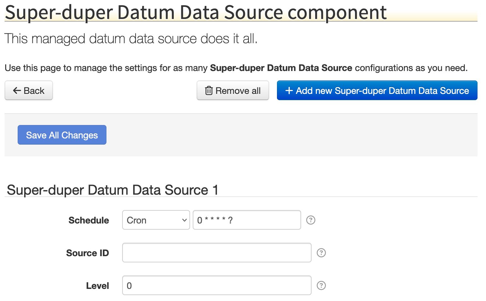

# Datum Data Source Poll Job

The [`DatumDataSourcePollManagedJob`][DatumDataSourcePollManagedJob] class is a [Job
Service](job-scheduler.md#job-service) implementation that can be used to let users schedule the
generation of datum from a [Datum Data Source](datum-data-source.md). Typically this is configured
as a [Managed Service Factory](../osgi/blueprint-compendium.md#managed-service-factory) so users
can configure any number of job instances, each with their own settings.

Here is a typical example of a `DatumDataSourcePollManagedJob`, in a fictional `MyDatumDataSource`:

=== "MyDatumDataSource.java"

	```java
	package com.example;

	import java.time.Instant;
	import java.util.Arrays;
	import java.util.List;
	import java.util.Map;
	import net.solarnetwork.domain.datum.DatumSamples;
	import net.solarnetwork.node.domain.datum.EnergyDatum;
	import net.solarnetwork.node.domain.datum.NodeDatum;
	import net.solarnetwork.node.domain.datum.SimpleEnergyDatum;
	import net.solarnetwork.node.service.DatumDataSource;
	import net.solarnetwork.node.service.support.DatumDataSourceSupport;
	import net.solarnetwork.settings.SettingSpecifier;
	import net.solarnetwork.settings.SettingSpecifierProvider;
	import net.solarnetwork.settings.SettingsChangeObserver;
	import net.solarnetwork.settings.support.BasicTextFieldSettingSpecifier;

	/**
	 * Super-duper datum data source.
	 *
	 * @author matt
	 * @version 1.0
	 */
	public class MyDatumDataSource extends DatumDataSourceSupport
			implements DatumDataSource, SettingSpecifierProvider, SettingsChangeObserver {

		private String sourceId;
		private int level;

		@Override
		public Class<? extends NodeDatum> getDatumType() {
			return EnergyDatum.class;
		}

		@Override
		public EnergyDatum readCurrentDatum() {
			final String sourceId = resolvePlaceholders(this.sourceId);
			if ( sourceId == null || sourceId.isEmpty() ) {
				return null;
			}
			SimpleEnergyDatum d = new SimpleEnergyDatum(sourceId, Instant.now(), new DatumSamples());
			d.setWatts(level);
			return d;
		}

		@Override
		public void configurationChanged(Map<String, Object> properties) {
			// the settings have changed; do something
		}

		@Override
		public String getSettingUid() {
			return "com.example.MyDatumDataSource";
		}

		@Override
		public List<SettingSpecifier> getSettingSpecifiers() {
			return Arrays.asList(new BasicTextFieldSettingSpecifier("sourceId", null),
					new BasicTextFieldSettingSpecifier("level", String.valueOf(0)));
		}

		public String getSourceId() {
			return sourceId;
		}

		public void setSourceId(String sourceId) {
			this.sourceId = sourceId;
		}

		public int getLevel() {
			return level;
		}

		public void setLevel(int level) {
			this.level = level;
		}

	}
	```

=== "MyDatumDataSource.properties Localization"

	```properties
	title = Super-duper Datum Data Source
	desc = This managed datum data source does it all.

	schedule.key = Schedule
	schedule.desc = The schedule to execute the job at. \
		Can be either a number representing a frequency in <b>milliseconds</b> \
		or a <a href="{0}">cron expression</a>, for example <code>0 * * * * *</code>.

	sourceId.key = Source ID
	sourceId.desc = The source ID to use.

	level.key = Level
	level.desc = This one goes to 11.
	```

=== "Blueprint XML"

	```xml
	<?xml version="1.0" encoding="UTF-8"?>
	<blueprint xmlns="http://www.osgi.org/xmlns/blueprint/v1.0.0"
		xmlns:xsi="http://www.w3.org/2001/XMLSchema-instance"
		xmlns:osgix="http://www.eclipse.org/gemini/blueprint/schema/blueprint-compendium"
		xmlns:beans="http://www.springframework.org/schema/beans"
		xsi:schemaLocation="
			http://www.osgi.org/xmlns/blueprint/v1.0.0
			http://www.osgi.org/xmlns/blueprint/v1.0.0/blueprint.xsd
			http://www.eclipse.org/gemini/blueprint/schema/blueprint-compendium
			http://www.eclipse.org/gemini/blueprint/schema/blueprint-compendium/gemini-blueprint-compendium.xsd
			http://www.springframework.org/schema/beans
			http://www.springframework.org/schema/beans/spring-beans.xsd">

		<!-- Service References -->

		<bean id="datumMetadataService" class="net.solarnetwork.common.osgi.service.DynamicServiceTracker">
			<argument ref="bundleContext"/>
			<property name="serviceClassName" value="net.solarnetwork.node.service.DatumMetadataService"/>
			<property name="sticky" value="true"/>
		</bean>

		<bean id="datumQueue" class="net.solarnetwork.common.osgi.service.DynamicServiceTracker">
			<argument ref="bundleContext"/>
			<property name="serviceClassName" value="net.solarnetwork.node.service.DatumQueue"/>
			<property name="sticky" value="true"/>
		</bean>

		<bean id="placeholderService" class="net.solarnetwork.common.osgi.service.DynamicServiceTracker">
			<argument ref="bundleContext"/>
			<property name="serviceClassName" value="net.solarnetwork.node.service.PlaceholderService"/>
			<property name="sticky" value="true"/>
		</bean>

		<bean id="messageSource" class="org.springframework.context.support.ResourceBundleMessageSource">
			<property name="basenames" value="com.example.MyDatumDataSource"/>
		</bean>

		<bean id="jobMessageSource" class="net.solarnetwork.support.PrefixedMessageSource">
			<property name="prefix" value="datumDataSource."/>
			<property name="delegate" ref="messageSource"/>
		</bean>

		<!-- Managed Service Factory for Datum Data Source -->

		<service interface="net.solarnetwork.settings.SettingSpecifierProviderFactory">
			<bean class="net.solarnetwork.settings.support.BasicSettingSpecifierProviderFactory">
				<property name="displayName" value="Super-duper Datum Data Source"/>
				<property name="factoryUid" value="com.example.MyDatumDataSource"/><!-- (1)! -->
				<property name="messageSource" ref="messageSource"/>
			</bean>
		</service>

		<osgix:managed-service-factory factory-pid="com.example.MyDatumDataSource"
				autowire-on-update="true" update-method="configurationChanged">
			<osgix:interfaces>
				<beans:value>net.solarnetwork.node.job.ManagedJob</beans:value>
			</osgix:interfaces>
			<bean class="net.solarnetwork.node.job.SimpleManagedJob"
					init-method="serviceDidStartup" destroy-method="serviceDidShutdown">
				<argument>
					<bean class="net.solarnetwork.node.job.DatumDataSourcePollManagedJob">
						<property name="datumMetadataService" ref="datumMetadataService"/>
						<property name="datumQueue" ref="datumQueue"/>
						<property name="datumDataSource">
							<bean class="com.example.MyDatumDataSource"><!-- (2)! -->
								<property name="datumMetadataService" ref="datumMetadataService"/>
								<property name="messageSource" ref="jobMessageSource"/>
								<property name="placeholderService" ref="placeholderService"/>
							</bean>
						</property>
					</bean>
				</argument>
				<argument value="0 * * * * ?"/>
				<property name="serviceProviderConfigurations"><!-- (3)! -->
					<map>
						<entry key="datumDataSource">
							<bean class="net.solarnetwork.node.job.SimpleServiceProviderConfiguration">
								<property name="interfaces">
									<list>
										<value>net.solarnetwork.node.service.DatumDataSource</value>
									</list>
								</property>
								<property name="properties">
									<map>
										<entry key="datumClassName" value="net.solarnetwork.node.domain.datum.EnergyDatum"/>
									</map>
								</property>
							</bean>
						</entry>
					</map>
				</property>
			</bean>
		</osgix:managed-service-factory>

	</blueprint>
	```

	1. The `factoryUid` is the same value as the `getSettingsUid()` value in `MyDatumDataSource.java`
	2. Hiding down here is our actual data source!
	3. Adding a service provider configuration is optional, but registers our data source as an
	   OSGi service, in addition to the `ManagedJob` that the Managed Service Factory registers.

When this plugin is deployed in SolarNode, the managed component will appear on the main [Settings
page](../../users/setup-app/settings/index.md) and then the component settings UI will look like this:

{width=744}

[DatumDataSourcePollManagedJob]: https://javadoc.io/doc/net.solarnetwork.node/net.solarnetwork.node/latest/net/solarnetwork/node/job/DatumDataSourcePollManagedJob.html
