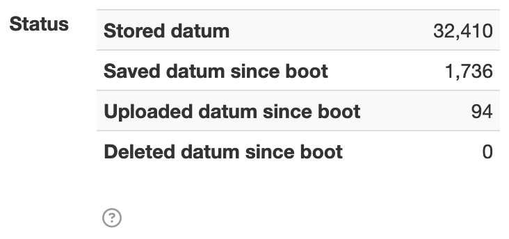

# Setting Specifier

The [`net.solarnetwork.settings.SettingSpecifier`][SettingSpecifier] API defines metadata for a
single configurable property in the Settings API. The API looks like this:

```java
public interface SettingSpecifier {

	/**
	 * A unique identifier for the type of setting specifier this represents.
	 *
	 * <p>
	 * Generally this will be a fully-qualified interface name.
	 * </p>
	 *
	 * @return the type
	 */
	String getType();

	/**
	 * Localizable text to display with the setting's content.
	 *
	 * @return the title
	 */
	String getTitle();

}
```

This interface is very simple, and extended by more specialized interfaces that form more useful
setting _types_.

!!! note

	A `SettingSpecifier` instance is often referred to simply as _a setting_.


Here is a view of the class hierarchy that builds off of this interface:

{width=317}

!!! note

	The `SettingSpecifier` API defines metadata about a configurable property, but not methods to
	view or change that property's value. The [Settings Service](../services/settings-service.md)
	provides methods for managing setting values.

## Settings Playpen

The [Settings Playpen][playpen] plugin demonstrates most of the available setting types, and is a
great way to see how the settings can be used.

## Text Field

The [`TextFieldSettingSpecifier`][TextFieldSettingSpecifier] defines a simple string-based
configurable property and is the most common setting type. The setting defines a `key` that maps to
a setter method on its associated component class. In the SolarNode GUI a text field is rendered as
an HTML form text input, like this:

{width=416}

The `net.solarnetwork.settings.support.BasicTextFieldSettingSpecifier` class provides the standard implementation
of this API. A standard text field setting is created like this:

```java
new BasicTextFieldSettingSpecifier("myProperty", "DEFAULT_VALUE");

// or without any default value
new BasicTextFieldSettingSpecifier("myProperty", null);

```

!!! tip

	Setting values are generally treated as strings within the Settings API, however other basic
	data types such as integers and numbers can be used as well. You can also publish a "proxy"
	setting that manages a complex data type as a string, and en/decode the complex type in your
	component accessor methods.

	For example a `Map<String, String>` setting could be published as a text field setting that
	en/decodes the `Map` into a delimited string value, for example `name=Test, color=red`.

### Secure Text Field

The `BasicTextFieldSettingSpecifier` can also be used for "secure" text fields where the field's
content is obscured from view. In the SolarNode GUI a secure text field is rendered as an HTML
password form input like this:

{width=435}

A standard secure text field setting is created by passing a third `true` argument, like this:

```java
new BasicTextFieldSettingSpecifier("myProperty", "DEFAULT_VALUE", true);

// or without any default value
new BasicTextFieldSettingSpecifier("myProperty", null, true);
```

## Title

The [`TitleSettingSpecifier`][TitleSettingSpecifier] defines a simple read-only string-based
configurable property. The setting defines a `key` that maps to a setter method on its associated
component class. In the SolarNode GUI the default value is rendered as plain text, like this:

{width=246}

The `net.solarnetwork.settings.support.BasicTitleSettingSpecifier` class provides the standard
implementation of this API. A standard title setting is created like this:

```java
new BasicTitleSettingSpecifier("status", "Status is good.", true);
```

### HTML Title

The [`TitleSettingSpecifier`][TitleSettingSpecifier] supports HTML markup. In the SolarNode GUI the
default value is rendered directly into HTML, like this:

{width=366}

```java
// pass `true` as the 4th argument to enable HTML markup in the status value
new BasicTitleSettingSpecifier("status", "Status is <b>good</b>.", true, true);
```

## Text Area

The [`TextAreaSettingSpecifier`][TextAreaSettingSpecifier] defines a simple string-based
configurable property for a larger text value, loaded as an external file using the
[SettingResourceHandler](resource-handler.md) API. In the SolarNode GUI a text area is rendered
as an HTML form text area with an associated button to upload the content, like this:

{width=476}

The `net.solarnetwork.settings.support.BasicTextAreaSettingSpecifier` class provides the standard implementation
of this API. A standard text field setting is created like this:

```java
new BasicTextAreaSettingSpecifier("myProperty", "DEFAULT_VALUE");

// or without any default value
new BasicTextAreaSettingSpecifier("myProperty", null);
```

### Direct Text Area

The `BasicTextAreaSettingSpecifier` can also be used for "direct" text areas where the field's
content is not uploaded as an external file. In the SolarNode GUI a direct text area is rendered as
an HTML form text area, like this:

{width=446}

A standard direct text area setting is created by passing a third `true` argument, like this:

```java
new BasicTextAreaSettingSpecifier("myProperty", "DEFAULT_VALUE", true);

// or without any default value
new BasicTextAreaSettingSpecifier("myProperty", null, true);
```

## Toggle

The [`ToggleSettingSpecifier`][ToggleSettingSpecifier] defines a boolean configurable property. In
the SolarNode GUI a toggle setting is rendered as an HTML form button, like this:

{width=142}

The `net.solarnetwork.settings.support.BasicToggleSettingSpecifier` class provides the standard implementation
of this API. A standard toggle setting is created like this:

```java
new BasicToggleSettingSpecifier("enabled", false); // default "off"

new BasicToggleSettingSpecifier("enabled", true);  // default "on"
```

## Slider

The [`SliderSettingSpecifier`][SliderSettingSpecifier] defines a number-based configuration property
with minimum and maximum values enforced, and a _step_ limit. In the SolarNode GUI a
slider is rendered as an HTML widget, like this:

{width=382}

The `net.solarnetwork.settings.support.BasicSliderSettingSpecifier` class provides the standard implementation
of this API. A standard Slider setting is created like this:

```java
// no default value, range between 0-11 in 0.5 increments
new BasicSliderSettingSpecifier("volume", null, 0.0, 11.0, 0.5);

// default value 5.0, range between 0-11 in 0.5 increments
new BasicSliderSettingSpecifier("volume", 5.0, 0.0, 11.0, 0.5);
```

## Radio Group

The [`RadioGroupSettingSpecifier`][RadioGroupSettingSpecifier] defines a configurable property that
accepts a single value from a fixed set of possible values. In the SolarNode GUI a radio group is
rendered as a set of HTML radio input form fields, like this:

{width=156}

The `net.solarnetwork.settings.support.BasicRadioGroupSettingSpecifier` class provides the standard implementation
of this API. A standard RadioGroup setting is created like this:

```java
String[] vals = new String[] {"a", "b", "c"};
String[] labels = new Strign[] {"One", "Two", "Three"};
Map<String, String> radioValues = new LinkedHashMap<>(3);
for ( int i = 0; i < vals.length; i++ ) {
	radioValues.put(vals[i], labels[i]);
}
BasicRadioGroupSettingSpecifier radio =
		new BasicRadioGroupSettingSpecifier("option", vals[0]);
radio.setValueTitles(radioValues);
```

## Multi-value

The [`MultiValueSettingSpecifier`][MultiValueSettingSpecifier] defines a configurable property that
accepts a single value from a fixed set of possible values. In the SolarNode GUI a multi-value
setting is rendered as an HTML select form field, like this:

{width=318}

The `net.solarnetwork.settings.support.BasicMultiValueSettingSpecifier` class provides the standard implementation
of this API. A standard MultiValue setting is created like this:

```java
String[] vals = new String[] {"a", "b", "c"};
String[] labels = new Strign[] {"Option 1", "Option 2", "Option 3"};
Map<String, String> radioValues = new LinkedHashMap<>(3);
for ( int i = 0; i < vals.length; i++ ) {
	radioValues.put(vals[i], labels[i]);
}
BasicMultiValueSettingSpecifier menu = new BasicMultiValueSettingSpecifier("option",
		vals[0]);
menu.setValueTitles(menuValues);
```

## File

The [`FileSettingSpecifier`][FileSettingSpecifier] defines a file-based resource property, loaded as
an external file using the [SettingResourceHandler](resource-handler.md) API. In the SolarNode GUI a
file setting is rendered as an HTML file input, like this:

{width=468}

The `net.solarnetwork.node.settings.support.BasicFileSettingSpecifier` class provides the standard implementation
of this API. A standard file setting is created like this:

```java
// a single file only, no default content
new BasicFileSettingSpecifier("document", null,
		new LinkedHashSet<>(Arrays.asList(".txt", "text/*")), false);

// multiple files allowed, no default content
new BasicFileSettingSpecifier("document-list", null,
		new LinkedHashSet<>(Arrays.asList(".txt", "text/*")), true);
```

## Dynamic List

A Dynamic List setting allows the user to manage a list of homogeneous items, adding or subtracting items as desired.
The items can be literals like strings, or arbitrary objects that define their own settings. In the SolarNode GUI a
dynamic list setting is rendered as a pair of HTML buttons to remove and add items, like this:

{width=198}

A Dynamic List is often backed by a Java `Collection` or array in the associated component. In addition
a special size-adjusting accessor method is required, named after the setter method with `Count` appended.
SolarNode will use this accessor to request a specific size for the dynamic list.

=== "Array-backed dynamic list accessors"

	```java
	private String[] names = new String[0];

	public String[] getNames() {
		return names;
	}

	public void setNames(String[] names) {
		this.names = names;
	}

	public int getNamesCount() {
		String[] l = getNames();
		return (l == null ? 0 : l.length);
	}

	public void setNamesCount(int count) {
		setNames(ArrayUtils.arrayOfLength(
			getNames(), count, String.class, String::new));
	}
	```

=== "List-backed dynamic list accessors"

	```java
	private List<String> names = new ArrayList<>();

	public List<String> getNames() {
		return names;
	}

	public void setNames(List<String> names) {
		this.names = names;
	}

	public int getNamesCount() {
		List<String> l = getNames();
		return (l == null ? 0 : l.size());
	}

	public void setNamesCount(int count) {
		if ( count < 0 ) {
			count = 0;
		}
		List<String> l = getNames();
		int lCount = (l == null ? 0 : l.size());
		while ( lCount > count ) {
			l.remove(l.size() - 1);
			lCount--;
		}
		if ( l == null && count > 0 ) {
			l = new ArrayList<>();
			setNames(l);
		}
		while ( lCount < count ) {
			l.add("");
			lCount++;
		}
	}
	```

The [`SettingUtils.dynamicListSettingSpecifier()`][SettingUtils] method simplifies the creation of a
[`GroupSettingSpecifier`][GroupSettingSpecifier] that represents a dynamic list (the examples in the
following sections demonstrate this).

### Simple Dynamic List

A _simple_ Dynamic List is a dynamic list of string or number values.

{width=420}

```java
private String[] names = new String[0];

@Override
public List<SettingSpecifier> getSettingSpecifiers() {
	List<SettingSpecifier> results = new ArrayList<>();

	// turn a list of strings into a Group of TextField settings
	GroupSettingSpecifier namesList = SettingUtils.dynamicListSettingSpecifier(
			"names", asList(names), (String value, int index, String key) ->
					singletonList(new BasicTextFieldSettingSpecifier(key, null)));
	results.add(namesList);

	return results;
}
```

### Complex Dynamic List

A _complex_ Dynamic List is a dynamic list of arbitrary object values. The main difference in terms
of the necessary settings structure required, compared to a Simple Dynamic List, is that a
group-of-groups is used.

{width=452}

=== "Complex data class"

	```java
	public class Person {
		private String firstName;
		private String lastName;

		// generate list of settings for a Person, nested under some prefix
		public List<SettingSpecifier> settings(String prefix) {
			List<SettingSpecifier> results = new ArrayList<>(2);
			results.add(new BasicTextFieldSettingSpecifier(prefix + "firstName", null));
			results.add(new BasicTextFieldSettingSpecifier(prefix + "lastName", null));
			return results;
		}

		public void setFirstName(String firstName) {
			this.firstName = firstName;
		}

		public void setLastName(String lastName) {
			this.lastName = lastName;
		}
	}
	```

=== "Dynamic List setting"

	```java
	private Person[] people = new Person[0];

	@Override
	public List<SettingSpecifier> getSettingSpecifiers() {
		List<SettingSpecifier> results = new ArrayList<>();

		// turn a list of People into a Group of Group settings
		GroupSettingSpecifier peopleList = SettingUtils.dynamicListSettingSpecifier(
				"people", asList(people), (Person value, int index, String key) ->
						singletonList(new BasicGroupSettingSpecifier(
							value.settings(key + "."))));
		results.add(peopleList);

		return results;
	}
	```


[playpen]: https://github.com/SolarNetwork/solarnetwork-node/tree/develop/net.solarnetwork.node.settings.playpen
[ArrayUtils]: https://javadoc.io/doc/net.solarnetwork.common/net.solarnetwork.common/latest/net/solarnetwork/util/ArrayUtils.html
[FileSettingSpecifier]: https://javadoc.io/doc/net.solarnetwork.node/net.solarnetwork.node/latest/net/solarnetwork/node/settings/FileSettingSpecifier.html
[GroupSettingSpecifier]: https://javadoc.io/doc/net.solarnetwork.common/net.solarnetwork.common/latest/net/solarnetwork/settings/GroupSettingSpecifier.html
[MultiValueSettingSpecifier]: https://javadoc.io/doc/net.solarnetwork.common/net.solarnetwork.common/latest/net/solarnetwork/settings/MultiValueSettingSpecifier.html
[RadioGroupSettingSpecifier]: https://javadoc.io/doc/net.solarnetwork.common/net.solarnetwork.common/latest/net/solarnetwork/settings/RadioGroupSettingSpecifier.html
[SettingSpecifier]: https://javadoc.io/doc/net.solarnetwork.common/net.solarnetwork.common/latest/net/solarnetwork/settings/SettingSpecifier.html
[SettingUtils]: https://javadoc.io/doc/net.solarnetwork.common/net.solarnetwork.common/latest/net/solarnetwork/settings/support/SettingUtils.html
[SliderSettingSpecifier]: https://javadoc.io/doc/net.solarnetwork.common/net.solarnetwork.common/latest/net/solarnetwork/settings/SliderSettingSpecifier.html
[TextAreaSettingSpecifier]: https://javadoc.io/doc/net.solarnetwork.common/net.solarnetwork.common/latest/net/solarnetwork/settings/TextAreaSettingSpecifier.html
[TextFieldSettingSpecifier]: https://javadoc.io/doc/net.solarnetwork.common/net.solarnetwork.common/latest/net/solarnetwork/settings/TextFieldSettingSpecifier.html
[TitleSettingSpecifier]: https://javadoc.io/doc/net.solarnetwork.common/net.solarnetwork.common/latest/net/solarnetwork/settings/TitleSettingSpecifier.html
[ToggleSettingSpecifier]: https://javadoc.io/doc/net.solarnetwork.common/net.solarnetwork.common/latest/net/solarnetwork/settings/ToggleSettingSpecifier.html
