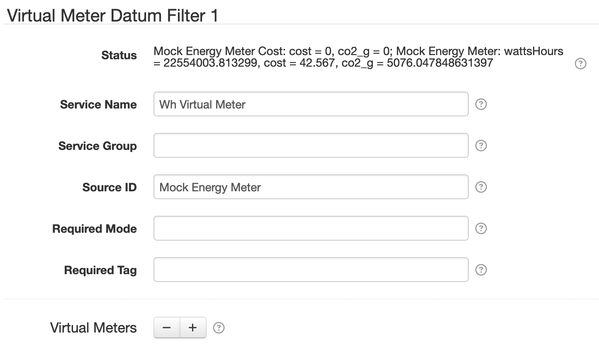
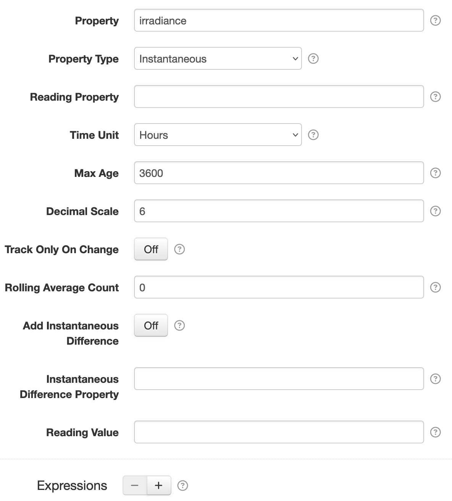

# Virtual Meter Datum Filter

The [Virtual Meter Datum Filter][src] provides a way to derive an accumulating "meter reading" value
out of an instantaneous property value over time. For example, if you have an irradiance sensor that
allows you to capture instantaneous W/m^2^ power values, you could configure a virtual meter to
generate Wh/m^2^ energy values.

Each virtual meter works with a single input datum property, typically an instantaneous property.
The derived accumulating datum property will be named after that property with the time unit suffix
appended. For example, an instantaneous `irradiance` property using the `Hours` time unit would
result in an accumulating `irradianceHours` property. The value is calculated as an **average**
between the _current_ and the _previous_ instantaneous property values, multiplied by the amount of
time that has elapsed between the two samples.

This filter is provided by the [Standard Datum Filters][sdf] plugin.

## Settings

<figure markdown>
  {width=722 loading=lazy}
</figure>

Each filter configuration contains the following overall settings:

| Setting            | Description |
|:-------------------|:------------|
--8<-- "snippets/users/datum-filters/base-filter-settings.md"
| Virtual Meters | Configure as many virtual meters as you like, using the ++plus++ and ++minus++ buttons to add/remove meter configurations. |

## Virtual Meter Settings

The Virtual Meter settings define a single virutal meter.

<figure markdown>
  {width=592 loading=lazy}
</figure>

| Setting               | Description                                                                           |
|:----------------------|:--------------------------------------------------------------------------------------|
| Property              | The name of the **input** datum property to derive the virtual meter values from. |
| Property Type         | The type of the **input** datum property. Typically this will be `Instantaneous` but when combined with an expression an `Accumulating` property can be used. |
| Reading Property      | The name of the **output** meter accumulating datum property to generate. Leave empty for a default name derived from **Property** and **Time Unit**. For example, an instantaneous `irradiance` property using the `Hours` time unit would result in an accumulating `irradianceHours` property. |
| Time Unit             | The time unit to record meter readings as. This value affects the name of the virtual meter reading property if **Reading Property** is left blank: it will be appended to the end of **Property Name**. It also affects the virtual meter output reading values, as they will be calculated in this time unit.|
| Max Age               | The maximum time allowed between samples where the meter reading can advance. In case the node is not collecting samples for a period of time, this setting prevents the plugin from calculating an unexpectedly large reading value jump. For example if a node was turned off for a day, the first sample it captures when turned back on would otherwise advance the reading as if the associated instantaneous property had been active over that entire time. With this restriction, the node will record the new sample date and value, but not advance the meter reading until another sample is captured within this time period. |
| Decimal Scale         | A maximum number of digits after the decimal point to round to. Set to `0` to round to whole numbers. |
| Track Only On Change  | When enabled, then only update the previous reading date if the new reading value differs from the previous one. |
| Rolling Average Count | A count of samples to average the property value from. When set to something greater than `1`, then apply a rolling average of this many property samples and output that value as the _instantaneous_ source property value. This has the effect of smoothing the instantaneous values to an average over the  time period leading into each output sample. Defaults to `0` so no rolling average is applied. |
| Add Instantaneous Difference | When enabled, then include an **output** instantaneous property of the difference between the current and previous reading values. |
| Instantaneous Difference Property | The derived **output** instantaneous datum property name to use when **Add Instantaneous Difference** is enabled. By default this property will be derived from the **Reading Property** value with `Diff` appended. |
| Reading Value         | You can reset the virtual meter reading value with this setting. :warning: **Note** this is an advanced operation. If you submit a value for this setting, the virtual meter reading will be reset to this value such that the next datum the reading is calculated for will use this as the current meter reading. This will impact the datum stream's reported aggregate values, so you should be very sure this is something you want to do. For example if the virtual meter was at `1000` and you reset it `0` then that will appear as a `-1000` drop in whatever the reading is measuring. If this occurs you can create a `Reset` [Datum auxiliary record][datum-aux] to accomodate the reset value. |
| Expressions           | Configure as many expressions as you like, using the ++plus++ and ++minus++ buttons to add/remove [expression configurations](#virtual-meter-expression-settings). |

## Virtual Meter Expression Settings

A virtual meter can use expressions to customise how the output meter value reading value is
calculated. See the [Expressions](#expressions) section for more information.

<figure markdown>
  {width=665 loading=lazy}
</figure>

| Setting             | Description                                                       |
|:--------------------|:------------------------------------------------------------------|
| Property            | The datum property to store the expression result in. This must match the **Reading Property** of a [meter configuration](#virtual-meter-settings). Keep in mind that if **Reading Property** is blank, the _implied_ value is derived from **Property** and **Time Unit**. |
| Property Type       | The datum property type to use. |
| Expression          | The expression to evaluate. See [below](#expressions) for more info. |
| Expression Language | The [expression language][expr] to write **Expression** in. |

## Filter parameters

When the virtual meter filter is applied to a given datum, it will generate the following filter
parameters, which will be available to other filters that are applied to the same datum _after_ this
filter.

| Parameter | Description |
|:----------|:------------|
| `{inputPropertyName}_diff` | The difference between the current **input** property value and the previous input property value. The `{inputPropertyName}` part of the parameter name will be replaced by the actual input property name. For example `irradiance_diff`. |
| `{meterPropertyName}_diff` | The difference between the current **output** meter property value and the previous output meter property value. The `{meterPropertyName}` part of the parameter name will be replaced by the actual output meter property name. For example `irradianceHours_diff`. |

## Expressions

Expressions can be configured to calculate the **output** meter datum property, instead of using the
default averaging algorithm. If an expression configuration exists with a **Property** that matches
a configured (or implied) meter configuration **Reading Property**, then the expression will be
invoked to generate the new meter reading value. See the [Expressions][expr] guide for general
expression language reference.

!!! warning

	It is important to remember that the expression must calculate the next _meter reading_ value.
	Typically this means it will calculate some differential value based on the amount of time that
	has elapsed and **add** that to the previous meter reading value.

### Expression root object

The root object is a [virtual meter expression object][VirtualMeterExpressionRoot] that lets you
treat all datum properties, and filter parameters, as expression variables directly, along with
the following properties:

| Property | Type | Description |
|:---------|:-----|:------------|
| `config` | `VirtualMeterConfig` | A [`VirtualMeterConfig`][VirtualMeterConfig] object for the virtual meter configuration the expression is evaluating for. |
| `datum` | `GeneralNodeDatum` | A [`Datum`][Datum] object, populated with data from all property and virtual meter configurations. |
| `props` | `Map<String,Object>` | Simple Map based access to the properties in `datum`, and transform parameters, to simplify expressions. |
| `currDate` | `long` | The current datum timestamp, as a millisecond epoch number. |
| `prevDate` | `long` | The previous datum timestamp, as a millisecond epoch number. |
| `timeUnits` | `decimal` | A decimal number of the difference between `currDate` and `prevDate` in the virtual meter configuration's **Time Unit**, rounded to at most 12 decimal digits. |
| `currInput` | `decimal` | The current **input** property value. |
| `prevInput` | `decimal` | The previous **input** property value. |
| `inputDiff` | `decimal` | The difference between the `currInput` and `prevInput` values. |
| `prevReading` | `decimal` | The previous **output** meter property value. |

The following methods are available:

| Function | Arguments | Result | Description |
|:---------|:----------|:-------|:------------|
| `has(name)` | `String` | `boolean` | Returns `true` if a property named `name` is defined. |
| `timeUnits(scale)` | `int` | `decimal` | Like the `timeUnits` property but rounded to a specific number of decimal digits. |

### Expression example: time of use tariff reading

Iagine you'd like to track a time-of-use cost associated with the energy readings captured by an
energy meter. The [Time-based Tariff Datum Filter][tariff-filter] filter could be used to add a
`tou` property to each datum, and then a virtual meter expression can be used to calculate a `cost`
reading property. The `cost` property will be an accumulating property like any meter reading, so
when SolarNetwork aggregates its value over time you will see the effective cost over each aggregate
time period.

Here is a screen shot of the settings used for this scenario (note how the **Reading Property** value
matches the Expression **Property** value):

<figure markdown>
  {width=699 loading=lazy}
</figure>

The important settings to note are:

| Setting | Notes |
|:--------|:------|
| Virtual Meter - Property | The **input** datum property is set to `wattHours` because we want to track changes in this property over time. |
| Virtual Meter - Property Type | We use `Accumulating` here because that is the type of property `wattHours` is. |
| Virtual Meter - Reading Property | The **output** reading property name. This must match the **Expression - Property** setting.  |
| Expression - Property | This must match the **Virtual Meter - Reading Property** we want to evaluate the expression for. |
| Expression - Property Type | Typically this should be `Accumulating` since we are generating a meter reading style property. |
| Expression - Expression | The expression to evaluate. This expression looks for the `tou` property and when found the meter reading is incremented by the difference between the current and previous input `wattHours` property values multiplied by `tou`. If `tou` is not available, then the previous meter reading value is returned (leaving the reading unchanged). |

Assuming a datum sample with properties like the following:

| Property      | Value |
|:--------------|:------|
| `tou`         | `11.00`          |
| `currDate`    | `1621380669005`  |
| `prevDate`    | `1621380609005`  |
| `timeUnits`   | `0.016666666667` |
| `currInput`   | `6095574`        |
| `prevInput`   | `6095462`        |
| `inputDiff`   | `112`            |
| `prevReading` | `1022.782`       |

Then here are some example expressions and the results they would produce:

| Expression | Result | Comment |
|:-----------|:-------|:--------|
| `inputDiff / 1000` | `0.112` | Convert the input Wh property difference to kWh. |
| `inputDiff / 1000 * tou` | `1.232` | Multiply the input kWh by the the $/kWh tariff value to calculate the cost for the elapsed time period. |
| `prevReading + (inputDiff / 1000 * tou)` | `1,024.014` | Add the additional cost to the previous meter reading value to reach the new meter value. |

--8<-- "snippets/users/datum-filters/base-filter-settings-links.md"
[placeholders]: ../placeholders.md
[sdf]: https://github.com/SolarNetwork/solarnetwork-node/blob/develop/net.solarnetwork.node.datum.filter.standard/
[src]: https://github.com/SolarNetwork/solarnetwork-node/blob/develop/net.solarnetwork.node.datum.filter.standard/README-VirtualMeter.md
[datum-aux]: https://github.com/SolarNetwork/solarnetwork/wiki/SolarNet-API-global-objects#datum-auxiliary
[expr]: ../expressions.md
[tariff-filter]: ./tariff.md
[Datum]: https://github.com/SolarNetwork/solarnetwork-common/blob/develop/net.solarnetwork.common/src/net/solarnetwork/domain/datum/Datum.java
[VirtualMeterConfig]: https://github.com/SolarNetwork/solarnetwork-node/blob/develop/net.solarnetwork.node.datum.filter.standard/src/net/solarnetwork/node/datum/filter/virt/VirtualMeterConfig.java
[VirtualMeterExpressionRoot]: https://github.com/SolarNetwork/solarnetwork-node/blob/develop/net.solarnetwork.node.datum.filter.standard/src/net/solarnetwork/node/datum/filter/virt/VirtualMeterExpressionRoot.java
