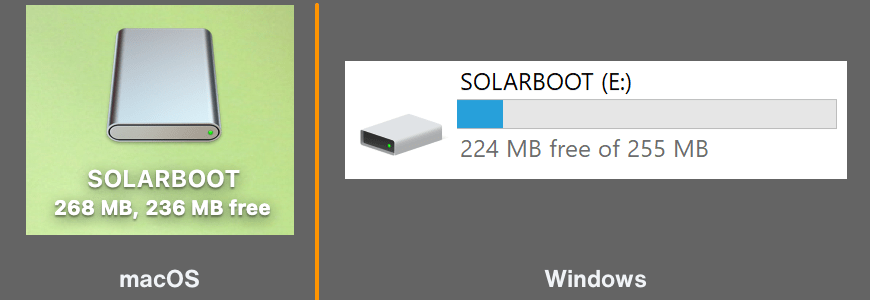

# Networking

SolarNode will attempt to automatically configure networking access from a local DHCP server. For
many deployments the local network router is the DHCP server. SolarNode will identify itself with
the name `solarnode`, so in many cases you can reach the SolarNode setup app at <http://solarnode/>.

## Finding SolarNode's network address

To find what network address SolarNode is using, you have a few options:

### Consult your network router

Your local network router is very likely to have a record of SolarNode's network connection. Log
into the router's management UI and look for a device named `solarnode`.

### Connect a keyboard and screen

If your SolarNode supports connecting a keyboard and screen, you can log into the SolarNode command line
console and run `#!sh ip -br addr` to print out a brief summary of the current networking configuration:

```
$ ip -br addr

lo               UNKNOWN        127.0.0.1/8 ::1/128
eth0             UP             192.168.0.254/24 fe80::e65f:1ff:fed1:893c/64
wlan0            DOWN
```

In the previous output, SolarNode has an ethernet device `eth0` with a network address `192.168.0.254`
and a WiFi device `wlan0` that is not connected. You could reach that SolarNode at
`http://192.168.0.254/`.

!!! tip

	You can get more details by running `#!sh ip addr` (without the `-br` argument).

## WiFi

If your device will use WiFi for network access, you will need to configure the network name and credentials to use.
You can do that by creating a `wpa_supplicant.conf` file on the SolarNodeOS media (typically an SD card). For Raspberry Pi media, you can mount the SD card on your computer and it will mount the appropriate drive for you.

{width=435}

Once mounted use your favorite text editor to create a `wpa_supplicant.conf` file with content like
this:

```
country=nz
network={
    ssid="wifi network name here"
    psk="wifi password here"
}
```

Change the `country=nz` to match your own country code.
