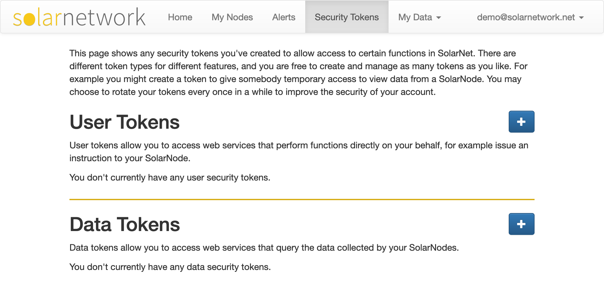

# Security Tokens

Some SolarNode features require SolarNetwork Security Tokens to use as [authentication credentails][auth]
for SolarNetwork services. Security Tokens are managed on the [Security Tokens][sec-tokens] page in
SolarNetwork.

<figure markdown>
  {width=935}
  <figcaption markdown>The Security Tokens page in SolarNetwork</figcaption>
</figure>

## User Tokens

**User Security Tokens** allow access to web services that perform functions directly on your
behalf, for example issue an instruction to your SolarNode.

Click the "+" button in the **User Tokens** section to generate a new security token. You will be shown
a form where you can give a name, description, and policy restrictions for the token.

<figure markdown>
  {width=590}
  <figcaption markdown>The form for creating a new User Security Token</figcaption>
</figure>

Click the **Generate Security Token** button to generate the new token. You will then be shown the
generated token. You will need to copy and save the token to a safe and secure place.

<figure markdown>
  {width=594}
  <figcaption markdown>A newly generated security token — make sure to save the token in a safe place</figcaption>
</figure>

## Data Tokens

**Data Security Tokens** allow access to web services that query the data collected by your SolarNodes.

Click the "+" button in the **Data Tokens** section to generate a new security token. You will be shown
a form where you can give a name, description, and policy restrictions for the token.

<figure markdown>
  {width=593}
  <figcaption markdown>The form for creating a new Data Security Token</figcaption>
</figure>

Click the **Generate Security Token** button to generate the new token. You will then be shown the
generated token. You will need to copy and save the token to a safe and secure place.

## Security Policy

Security tokens can be configured with a **Security Policy** that restricts the types of functions or data the
token has permission to access.

| Policy | User | Node | Description |
|:-------|:-----|:-----|:------------|
| [API Paths](#api-paths) | :white_check_mark: | :white_check_mark: | Restrict the token to specific API methods. |
| [Expiry](#expiry) | :white_check_mark: | :white_check_mark: | Make the token invalid after a specific date. |
| [Minimum Aggregation](#minimum-aggregation) |  | :white_check_mark: | Restrict the data aggregation level allowed. |
| [Node IDs](#node-ids) |  | :white_check_mark: | Restrict to specific node IDs. |
| [Refresh Allowed](#refresh-allowed) | :white_check_mark: | :white_check_mark: | Make the token invalid after a specific date. |
| [Source IDs](#source-ids) |  | :white_check_mark: | Restrict to specific datum source IDs. |
| [Node Metadata](#node-metadata) |  | :white_check_mark: | Restrict to specific node metadata. |
| [User Metadata](#user-metadata) |  | :white_check_mark: | Restrict to specific user metadata. |

### API Paths

The API Paths policy restricts the token to specific SolarNet API methods, based on their URL path. If this policy is
not included then all API methods are allowed.

### Expiry

The Expiry policy makes the token invalid after a specific date. If this policy is not included, the token
does not ever expire.

### Minimum Aggregation

The Minimum Aggregation policy restricts the token to a minimum data aggregation level. If this policy is not included,
or of the minimum level is set to **None**, data for any aggregation level is allowed.

### Node IDs

The Node IDspolicy restrict the token to specific node IDs. If this policy is not
included, then the token has access to **all** node IDs in your SolarNetwork account.

### Node Metadata

The Node Metadata policy restricts the token to specific portions of node-level [metadata][metadata]. If this policy is
not included then all node metadata is allowed.

### Refresh Allowed

The Refresh Allowed policy grants applications given a signing key rather than the token's private password can refresh the key as long as the token has not expired.

### Source IDs

The Source IDs policy restrict the token to specific datum source IDs. If this policy is not
included, then the token has access to **all** source IDs in your SolarNetwork account.

### User Metadata

The User Metadata policy restricts the token to specific portions of account-level [metadata][metadata]. If this policy is
not included then all user metadata is allowed.

[sec-tokens]: https://data.solarnetwork.net/solaruser/u/sec/auth-tokens
[auth]: https://github.com/SolarNetwork/solarnetwork/wiki/SolarNet-API-authentication-scheme-V2
[metadata]: https://github.com/SolarNetwork/solarnetwork/wiki/SolarNet-API-global-objects#metadata
