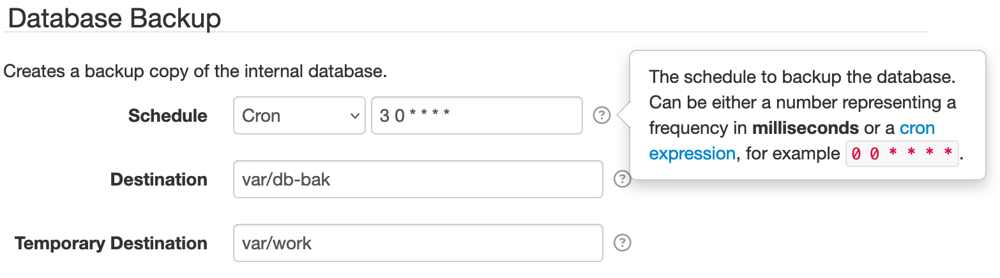

# Settings Files

SolarNode plugins support configurable properties, called _settings_. The SolarNode setup app allows
you to manage settings through simple web forms.

Settings can also be exported and imported in a CSV format, and can be applied when SolarNode starts
up with [Auto Settings](#auto-settings) CSV files. Here is an example of a settings form in the
SolarNode setup app:

{width=783}

There are 3 settings represented in that screen shot:

 1. Schedule
 2. Destination
 3. Temporary Destination

!!! tip
	Nearly every form field you can edit in the SolarNode setup app represents a setting for a
	component in SolarNode.

In the SolarNode setup app the settings can be imported and exported from the main Settings screen:

{width=742}

## Settings CSV example

Here's an example snippet of a settings CSV file:

```csv
net.solarnetwork.node.io.modbus.1,serialParams.baudRate,19200,0,2014-03-01 21:01:31
net.solarnetwork.node.io.modbus.1,serialParams.parityString,even,0,2014-03-01 21:01:31
net.solarnetwork.node.io.modbus.1,serialParams.portName,/dev/cuaU0,0,2014-03-01 21:01:31
net.solarnetwork.node.io.modbus.FACTORY,1,1,0,2014-03-01 21:00:31
```

These settings all belong to a `net.solarnetwork.node.io.modbus` component. The meaning
of the CSV columns is discussed in the following section.

## Settings CSV syntax

Settings files are CSV (comma separated values) files, easily exported from spreadsheet applications
like Microsoft Excel or Google Sheets. The CSV **must** include a header row, which is skipped. All
other rows will be processed as settings.

The Settings CSV format uses a quite general format and contains the following columns:

| # | Name | Description |
|:--|:-----|:------------|
| 1 | key  | A unique identifier for the service the setting applies to. |
| 2 | type | A unique identifier for the setting with the service specified by `key`, typically using [standard property syntax](#setting-property-syntax). |
| 3 | value | The setting value. |
| 4 | flags | An integer bitmask of flags associated with the setting. See the [flags section](#setting-flags) for more info. |
| 5 | modified | The date the setting was last modified, in `yyyy-MM-dd HH:mm:ss` format. |

To understand the `key` and `type` values required for a given component requires consulting the
documentation of the plugin that provides that component. You can get a pretty good picture of what
the values are by exporting the settings after configuring a component in SolarNode. Typically the
`key` value will mirror a plugin's Java package name, and `type` follows a JavaScript-like property
accessor syntax representing a configurable property on the component.

### Setting property syntax

The `type` setting value usually defines a component property using a JavaScript-like syntax with
these rules:

| Expression | Example | Description |
|:----------------|:--------|:------------|
| Property        | `name`         | a property named `name` |
| Nested property | `name.subname` | a nested property `subname` on a parent property `name` |
| List property   | `name[0]`      | the first element of an indexed list property named `name` |
| Map property    | `name['key']`  | the `key` element of the map property `name` |

These rules can be combined into complex expressions, for example `propIncludes[0].name` or
`delegate.connectionFactory.propertyFilters['UID']`.

### Setting flags

Each setting has a set of flags that can be associated with it. The following table outlines the
bit offset for each flag along with a description:

| # | Name | Description |
|:--|:-----|:------------|
| 0 | Ignore modification date | If this flag is set then changes to the associated setting will not trigger a new auto backup. |
| 1 | Volatile | If this flag is set then changes to the associated setting will not trigger an internal "setting changed" event to be broadcast. |

**Note** these are bit offsets, so the decimal value to ignore modification date is `1`, to mark
as volatile is `2`, and for both is `3`.

### Component factories

Many plugins provide _component factories_ which allow you to configure any number of _instances_ of
that component. Each component _instance_ is assigned a unique _identifier_ when it is created. In
the SolarNode setup app, the component instance identifiers appear throughout the UI:

{width=736}

In the previous [example CSV](#settings-csv-example) the **Modbus I/O** plugin allows you to
configure any number of Modbus connection components, each with their own specific settings. That is
an example of a component factory. The settings CSV will include a special row to indicate that such
a factory component should be activated, using a unique identifier, and then all the settings
associated with that factory _instance_ will have that unique identifier appended to its `key`
values.

Going back to that example CSV, this is the row that activates a Modbus I/O component instance with
an identifier of `1`:

```csv
net.solarnetwork.node.io.modbus.FACTORY,1,1,0,2014-03-01 21:00:31
```

The synax for `key` column is simply the service identifier followed by `.FACTORY`. Then the `type`
and `value` columns are both set the same unique identifier. In this example that identifier is `1`.
For all settings specific to a factory component, the `key` column will be the service identifier
followed by `.IDENTIFIER` where `IDENTIFIER` is the unique instance identifier.

Here is an example that shows two factory instances configured: `Lighting` and `HVAC`. Each have a
different `serialParams.portName` setting value configured:

```csv
net.solarnetwork.node.io.modbus.Lighting,serialParams.portName,/dev/cuaU0,0,2014-03-01 21:01:31
net.solarnetwork.node.io.modbus.HVAC,serialParams.portName,/dev/ttyUSB0,0,2014-03-01 21:01:31
net.solarnetwork.node.io.modbus.FACTORY,Lighting,Lighting,0,2014-03-01 21:00:31
net.solarnetwork.node.io.modbus.FACTORY,HVAC,HVAC,0,2014-03-01 21:00:31
```

## Auto settings

SolarNode settings can also be configured through Auto Settings, applied when SolarNode starts up,
by placing Settings CSV files in the `/etc/solarnode/auto-settings.d` directory. These settings are
applied only if they don't already exist or the modified date in the settings file is newer than the
date they were previously applied.
