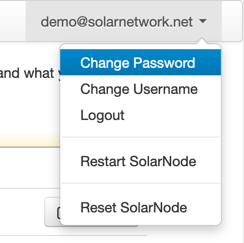
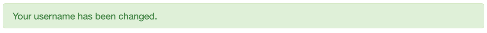

# Profile

The profile menu
in the top-right of the Setup App menu give you access to [change  you password](#change-password), [change  you username](#change-username), [logout](#logout), [restart](#restart), and [reset](#reset) SolarNode.

!!! tip

	Your SolarNode credentials are not related, or tied to, your
	[SolarNetwork](https://data.solarnetwork.net/solaruser/) login credentials. Changing your
	SolarNode username or password does not change your SolarNetwork credentials.

<figure markdown>
  {width=243}
  <figcaption markdown>The profile menu in SolarNode</figcaption>
</figure>

## Change Password

Choosing the **Change Password** menu item will take you to a form for changing your password. Fill in your current
password and then your new password, then click the **Submit Password** button.

<figure markdown>
  {width=650}
  <figcaption markdown>The **Change Password** form</figcaption>
</figure>

As a result, you will stay on the same page, but a success (or error) message will be shown above the form:

{width=740}

## Change Username

Choosing the **Change Username** menu item will take you to a form for changing your SolarNode username. Fill in your current
password and then your new password, then click the **Change Username** button.

<figure markdown>
  {width=428}
  <figcaption markdown>The **Change Username** form</figcaption>
</figure>

As a result, you will stay on the same page, but a success (or error) message will be shown above the form:

{width=740}

## Logout

Choosing the **Logout** menu item will immediately end your SolarNode session and log you out. You will ned to
log in again to use the Setup App further.

## Restart

You can either _restart_ or _reboot_ SolarNode from the **Restart SolarNode** menu. A **restart**
means the SolarNode app will restart, while a **reboot** means the entire SolarNodeOS device will
shut down and boot up again (restarting SolarNode along the way).

You might need to restart SolarNode to pick up new plugins you've installed, and you might need to
reboot SolarNode if you've attached new sensors or other devices that require operating system
support.

<figure markdown>
  {width=560}
  <figcaption markdown>The **Restart SolarNode** menu brings up this dialog.</figcaption>
</figure>

## Reset

You can perform a "factory reset" of SolarNode to remove all your custom settings, certificate,
login credentials, and so on. You also have the option to preserve some SolarNodeOS settings
like WiFi credentials if you like.

<figure markdown>
  {width=560}
  <figcaption markdown>The **Reset SolarNode** menu brings up this dialog.</figcaption>
</figure>
