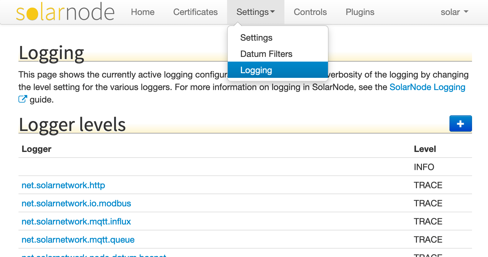

# Logging

The SolarNode UI supports configuring logger levels dynamically, without having to change the
[logging configuration file](../../logging.md).

!!! warning

	When SolarNode restarts all changes made in the Logger UI will be lost and the logger
	configuration will revert to whatever is configured in the logging configuration file.

{width="779" loading=lazy}

The Logging page lists all the configured logger levels and lets you add new loggers and edit the
existing ones using a simple form.

{width="555" loading=lazy}

